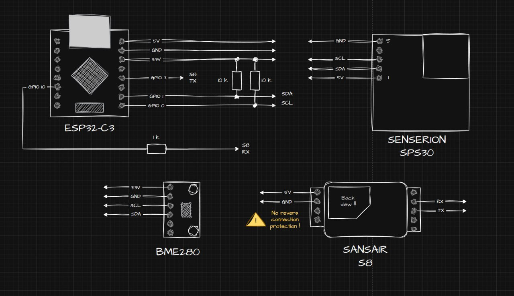
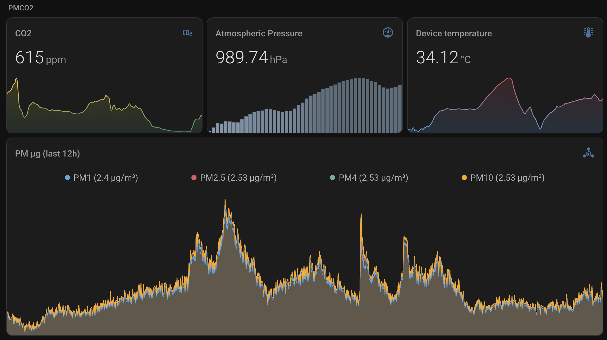

# ESPHome PMCO2 sensor

Simple ESPHome sensor, that allow combine crucial air quality measurements in one place.

## ✨ Features

| Sensor | Value | Bus | Update int. | Notes |
|--------|--------------|-----|-------------|-------|
|**Senseair S8** | CO₂ (400 – 10 000 ppm) | UART @ 9600 | 30 s | Manual 400 ppm calibration button |
|**Sensirion SPS30** | PM1/2.5/4/10 mass **+** number conc. | I²C @ 0x69 | 60 s | Manual fan clean button |
| BMP280 | Temperature, Pressure | I²C @ 0x76 | 60 s |  |

## 🛠️ Hardware

- ESP32-C3 **SuperMini**
- Senseair **S8 Commercial** (UART)
- Sensirion **SPS30** PM sensor
- BME280 / BMP280 breakoutLILYGO T-PicoC3
- 1 kΩ resistor (ESP-TX → S8-RX)
- 470 µF electrolytic (5 V rail decoupling)
- 5 V / 1 A USB-C PSU + short cable

## 🔎 Measurments

- Atmospheric Pressure (hPa)
- CO₂ (ppm)
- Device Temperature (°C)
- PM1.0 (µg/m³)
- PM4.0 (µg/m³)
- PM10 (µg/m³)
- PM2.5 (µg/m³)
- PM0.5 Count (#/cm³)
- PM1 Count (#/cm³)
- PM10 Count (#/cm³)
- PM2.5 Count (#/cm³)
- PM4 Count (#/cm³)
- Typical Particle Size (µm)

## 📏 Calibration workflow

- Put device for ~15min on open fresh air
- Press button "S8 • 400 ppm background calibration"
- Wait for a minute
- It should start showing smth around 400 ppm on the open air

---

Have fun, breathe clean!
